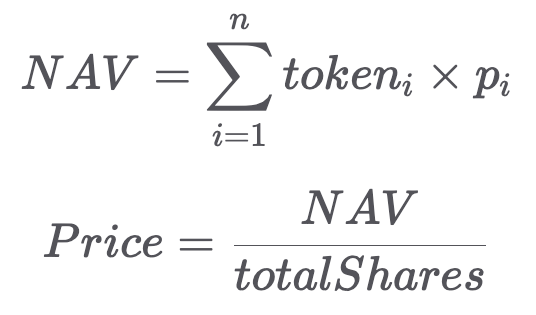

# Pricing

### NAV <a href="#nav" id="nav"></a>

The price of a DTF is based on a NAV (Net Asset Value) calculation.

Given a DTF with a basket of `n` tokens, each with a spot price `p`, we can calculate the DTF's price as:

<figure><figcaption></figcaption></figure>

### Onchain pricing <a href="#onchain-pricing" id="onchain-pricing"></a>

The `toAssets()` function is used to convert a DTF share to its underlying assets. It will return the one-to-many exchange rate of the DTF.

```
function toAssets(uint256 shares, Math.Rounding rounding) returns (address[] memory _assets, uint256[] memory _amounts);
```

Solidity Code: [Folio.toAssets()](https://github.com/reserve-protocol/reserve-index-dtf/blob/main/contracts/Folio.sol#L311)

#### Inputs <a href="#inputs" id="inputs"></a>

* `shares` Number of DTF shares to quote
* `rounding` Rounding method for output values (enum). One of:
  * \[0] Floor (Toward negative infinity)
  * \[1] Ceil (Toward positive infinity)
  * \[2] Trunc (Toward zero)
  * \[3] Expand (Away from zero)

#### Outputs <a href="#outputs" id="outputs"></a>

* `_assets` Array of addresses for each asset in the quote
* `_amounts` Array of amounts of each asset in the quote
