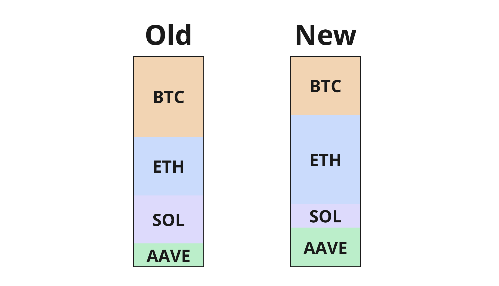
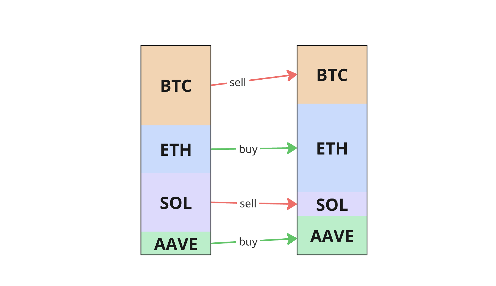

# Rebalancing

### Rebalancing DTF baskets

Any alteration of a DTF’s basket is done via a Dutch auction. Each auction is configured with parameters to define which tokens are to be traded, the pricing curve of the auction, and the target end ratios of the tokens in the basket.

### Auction pricing 

When configuring an auction for approval by governance, the **Expected Volatility (EV)** presets can be used to set the pricing curve and target token ratios. Choosing **Low EV** will configure a smaller pricing curve with more compact target ratio ranges, while choosing **High EV** will configure a much wider pricing curve with wider target ratio ranges.

When launching an auction via the Reserve app as the **Auction Launcher**, the **EV** presets can again be used to set the final pricing curve and target ratios.

When launching an auction via the Reserve app as any other actor, the **EV** presets are not available, as permissionless auction launches are not able to modify the pricing curve.

### Auction timing 

The **time-to-live (TTL)** parameter gets set when a rebalance auction is approved. This parameter defines how long a rebalance auction can exist in the Approved state before it is considered invalid and can no longer be launched.

The **TTL** matters significantly, especially with respect to the Admin-defined **Auction Delay** parameter. The **Auction Delay** defines how much time an auction can exist in the Approved state before it can be launched by anyone. Before the delay ends, the only actor that can launch the auction is the **Auction Launcher.**

Setting the **TTL** longer than the **Auction Delay** creates a period when the auction can be launched permissionlessly, adding to the DTF’s decentralization. If **TTL** is set at or below **Auction Delay**, then the **Auction Launcher** will be the only actor that is ever able to launch the auction. This gives more control to the **Auction Launcher** and entrusts them with more responsibility, so any **Auction Approver** should be sure about the TTL that they set.

### Basket-wide rebalancing auctions 

Index DTFs are rebalanced by approving a target basket, and then opening auctions that allow market participants to bid on _any_ surplus:deficit token pair until the tokens in the basket reach their respective target ratios.

### CoW Swap participation 

Since release 4.0.0, Index DTFs are able to utilize the new **Trusted Fillers** integration. The first Trusted Filler that has been integrated for Reserve Index DTFs is **CoW Swap**. Adopting **CoW Swap** as a Trusted Filler means that whenever the DTF has a rebalance auction, potential bids can be sent to the **CoW Swap** solver network, allowing solvers to bid directly in the auctions. This has 2 major benefits:

1. It ensures the DTF will always have competitive bidders participating in its rebalance auctions.
2. It connects rebalance auctions with the deep liquidity and best-price guarantees of the **CoW Swap** DEX.
