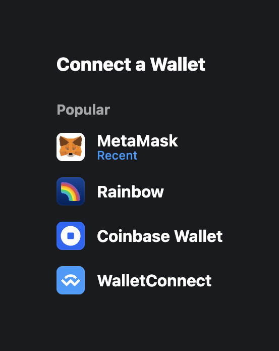
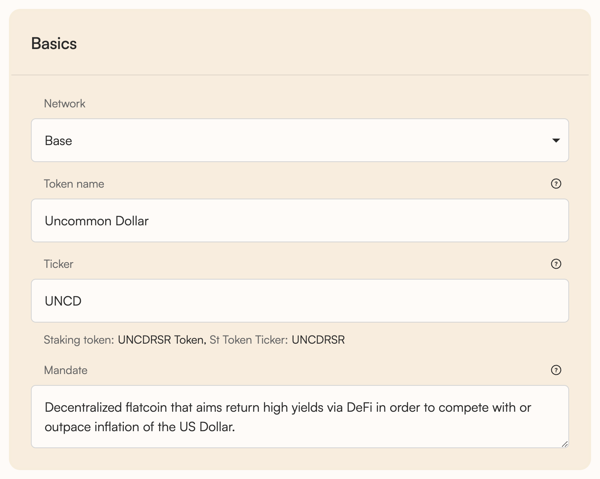
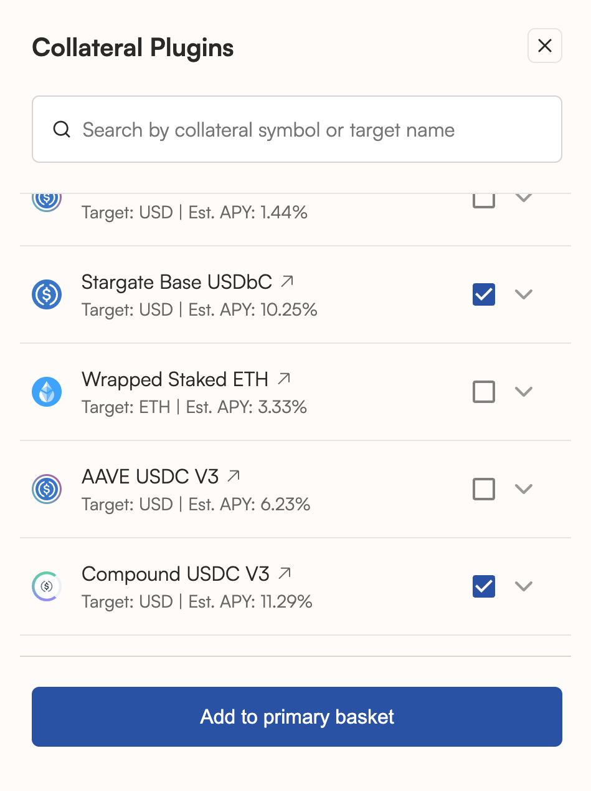
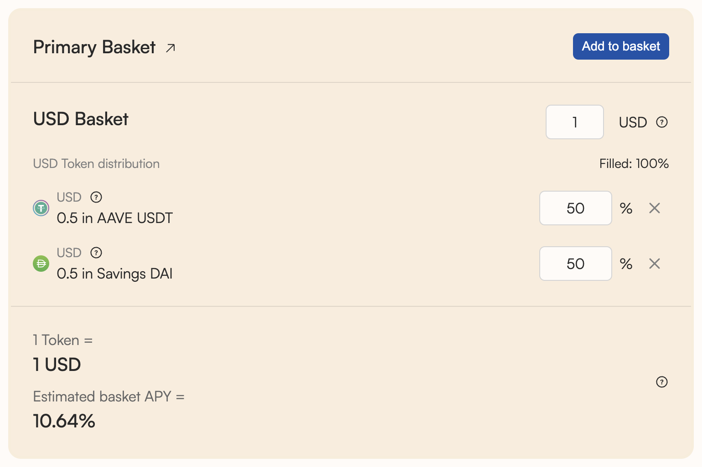
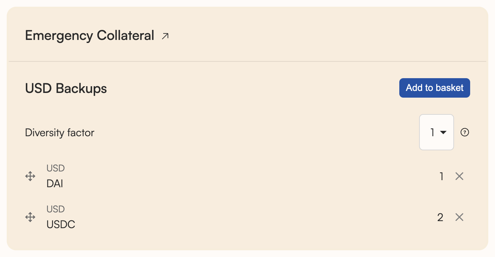
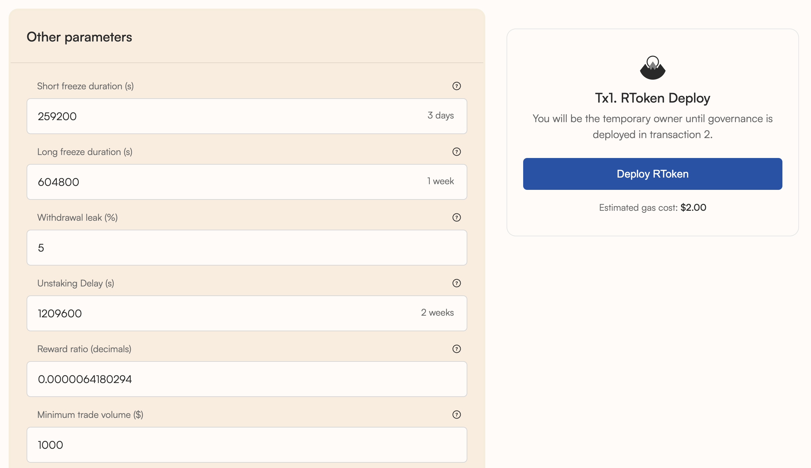
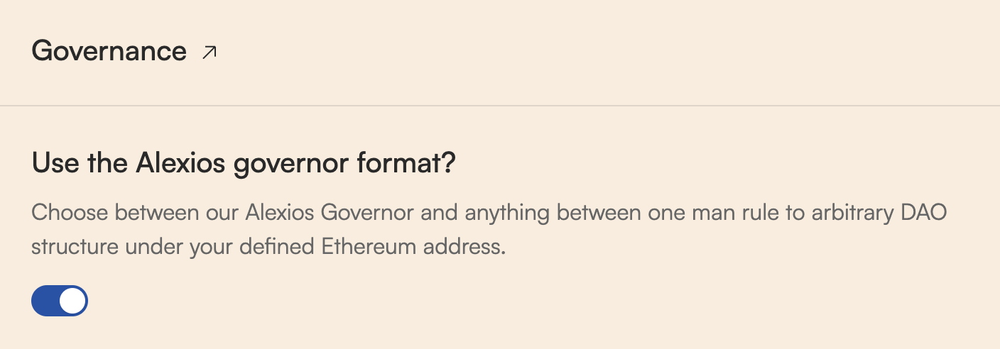
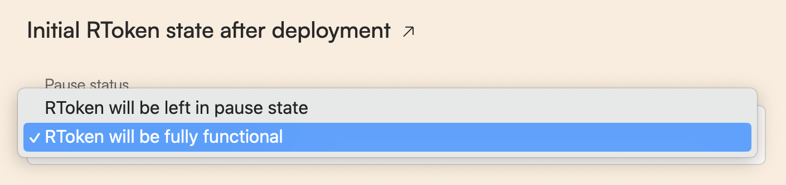
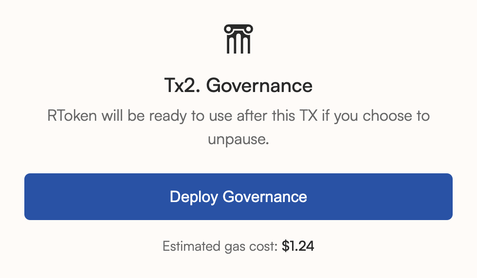
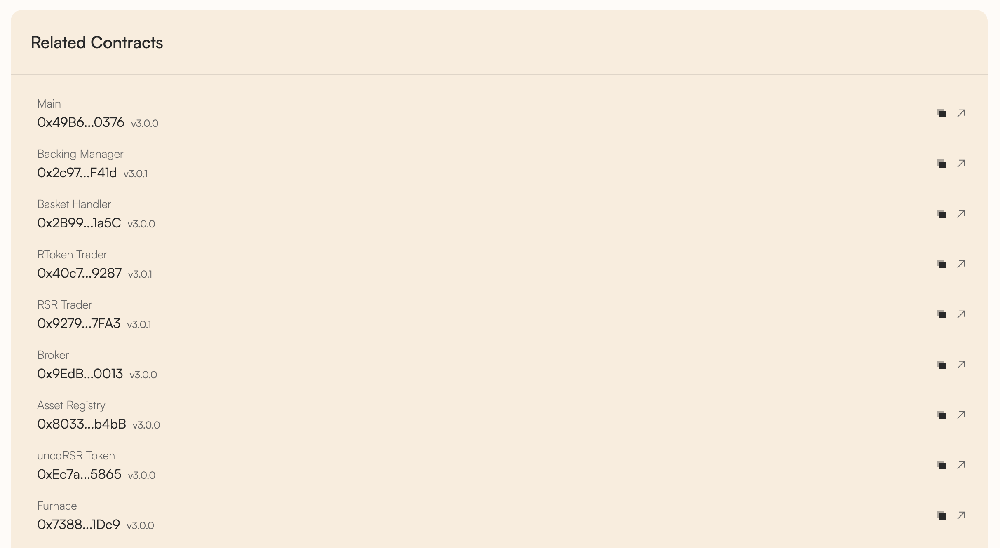

# Yield DTF deployment walkthrough

The Reserve Yield Protocol allows anyone to permissionlessly create Yield DTFs backed 1:1 by collateral assets of their choosing. The options for governance design and operational parameters available to deployers are essentially limitless.

This guide walks through the main steps to deploying a Yield DTF using the Reserve app: https://app.reserve.org/deploy/yield-dtf



### Getting started

* Navigate to the Yield DTF deployer UI: https://app.reserve.org/deploy/yield-dtf
* Connect your wallet using the Connect button in the top right.




### Define your DTF

A DTF's name, ticker, and mandate are important as unique identifiers which serve to convey its core purpose and set it apart from other products in the marketplace.

* Network — The DTF's native blockchain
* Token Name — The DTF's full name
* Ticker — The DTF's abbreviated symbol (Staking token names and tickers are auto-generated)
* Mandate — Description of the goals the DTF's governors should try to achieve. By briefly explaining the DTF’s purpose and what the RToken is intended to do, it provides common ground for the governors to decide upon priorities and how to weigh tradeoffs.



### Configure basket

Now it’s time to define what collateral assets back your DTF, and in what proportions. Emergency collateral can also be defined as fallbacks in the event any primary collateral defaults.

A number of collateral plugins can be employed “out-of-the-box.” If a desired collateral plugin doesn’t already exist, developers may create and deploy custom plugins — see the [appendix](#appendix) below.

* Under “Primary Basket,” click the “Add to basket” button
* Select your desired collateral assets. In this example, a number of yield bearing stablecoin positions will be used.

Note: In order to mint the DTF after it’s created, deployers must either have the selected collateral assets in their wallet, or use the “Zap Minting” utility, which enables minting using just 1 asset (e.g., mint eUSD using just USDC).

* Once satisfied with the selected assets, click “Add to basket”.
* Select your asset distributions, as well as the number of target units (e.g. USD, BTC, ETH) your “Target Basket” comprises.




### Configure backup basket

It’s generally recommended to configure Emergency Collateral in a backup basket. These are defined separately for each target unit.

* The ‘Diversity factor’ of your backups dictates the number of backup assets the DTF will scale into when exiting defaulted collateral (split evenly if there are multiple backups).




### Configure parameters

This section discusses what each configuration parameter does, and why it’s important. For more information on each parameter, see [Advanced parameters](advanced-parameters.md).

Note that the Reserve app provides sensible defaults and unless you’re an advanced user, you can deploy your RToken using the defaults and skip this section.

#### Backing Manager parameters

| Parameter                  |                         Default | Purpose                                                                | Common adjustments                     |
| -------------------------- | ------------------------------: | ---------------------------------------------------------------------- | -------------------------------------- |
| Trading delay              |                             0 s | Delay before trading after basket change; avoids thin‑liquidity losses | Longer for illiquid tokens             |
| Warm‑up period             |                          15 min | Delay after SOUND status before mint/trade opens                       | Rarely changed                         |
| Batch‑auction length       |                          15 min | Duration of Gnosis EasyAuction batch auctions                          | Extend in low‑volume markets           |
| Dutch‑auction length       | 30 min (mainnet) / 15 min (L2s) | Duration of preferred Dutch auctions                                   | Extend in illiquid markets             |
| Backing buffer             |                            0.1% | Extra collateral held before forwarding to Revenue Trader              | Increase for illiquid assets           |
| Max trade slippage         |                            0.5% | Max deviation from oracle price per trade                              | Increase for illiquid assets           |
| Issuance throttle rate     |                    10% per hour | Cap on new mints (% of supply)                                         | Relax (increase) after launch          |
| Issuance throttle amount   |                     2M per hour | Absolute mint cap (larger of rate vs amount)                           | Adjust for TVL                         |
| Redemption throttle rate   |                  12.5% per hour | Cap on redemptions (% of supply)                                       | Relax (increase) if basket very liquid |
| Redemption throttle amount |                   2.5M per hour | Absolute redemption cap                                                | Adjust for TVL                         |

#### Other parameters

| Parameter               |         Default | Purpose                                                                                              |
| ----------------------- | --------------: | ---------------------------------------------------------------------------------------------------- |
| Short‑freeze duration   |          3 days | One‑shot short freeze window                                                                         |
| Long‑freeze duration    |          1 week | Long freeze window (6 charges)                                                                       |
| Withdrawal leak         |              5% | Max RSR that can exit stRSR before status refresh                                                    |
| Unstaking delay         |         2 weeks | Wait after unstake before RSR can be withdrawn                                                       |
| Reward ratio            | 7‑day half‑life | Exponential drip rate of accrued rewards                                                             |
| Minimum trade volume    |       $1000 USD | Prevents micro‑auctions on dust balances during rebalancing (not during revenue processing auctions) |
| RToken max trade volume |         $1M USD | Upper limit for trades involving the DTF token                                                       |

Additional details on trading delay(s)

* The trading delay defines how many seconds should pass after the basket has been changed before a trade can be opened.
* A collateral asset can instantly default if one of the invariants of the underlying DeFi protocol breaks. If that happened, and we did not apply a trading delay, the protocol would react instantly by opening an auction. This would give only auctionLength seconds for people to bid on the auction, making it very possible for the protocol to lose value due to slippage.
* The trading delay parameter may only be needed in the early days — once a robust market of MEV searchers is established this can likely be set to zero.



### Deploy

Once you’re satisfied with your DTF’s name, basket composition, and other parameters, click the “Deploy” button which will prompt you to sign a transaction (“Tx1”).

Congratulations — you have successfully deployed your Yield DTF. However, no governance system has yet been configured. Continue reading to learn how to set up decentralized governance on your DTF using [Governor Anastasius](../../rsr-reserve-rights.md#governor-anastasius).

Note that if you aren’t yet ready to set up governance, you can leave your RToken paused and return later to finish.



### Set up governance

* If you wish to use Governor Anastasius (default; recommended by Reserve), ensure the corresponding toggle is active.

* Carefully select addresses for Guardian, Pauser, and Freezer roles. See the [roles documentation](https://github.com/reserve-protocol/protocol/blob/master/docs/system-design.md).

Addresses for each role are separate from each other and from the Guardian. However, often the Guardian address is also included in the other three roles.

Next, configure the ‘Governance parameters’.

Note that the Reserve app provides sensible defaults and unless you’re an advanced user, you can deploy Governance using the defaults and skip this section.

#### Governance parameters

| Parameter                |        Default | Purpose                                                         |
| ------------------------ | -------------: | --------------------------------------------------------------- |
| Snapshot delay           |         2 days | Time between proposal submission and vote‑power snapshot/voting |
| Voting period            |         3 days | Time from vote start to vote end                                |
| Proposal execution delay |         3 days | Time between vote success and execution                         |
| Proposal threshold       | 0.01% of stRSR | Minimum stake needed to submit a proposal                       |
| Quorum                   |   10% of stRSR | Minimum “for + abstain” participation to pass                   |

Select whether your DTF will be left in a paused state or functional after configuring governance (i.e., whether the DTF should be active immediately post-deployment, or whether governors should decide to start in a paused state).

Once you’ve made a selection, click “Deploy Governance”. Once that transaction confirms, the DTF is live onchain with the live state parameters you chose above.




## Closing

All of the DTF’s relevant contracts can be viewed under the “Related Contracts” section of the UI. The DTF is now ready to accept collateral assets and be used throughout the ecosystem.

The deployment process is complete. Ongoing attention and marketing are required for DTFs to distinguish themselves in a crowded marketplace and truly flourish. Check out the [post‑launch playbook](post-launch-playbook.md).

Join the [Reserve Telegram channel](https://t.me/reservecurrency) to share knowledge with and learn from other DTF deployers.

***

## Appendix

### How to create custom RToken collateral plugins

Deployers have the option to create and use custom collateral plugins for an RToken by adding a custom plugin contract address in the Primary Basket or Emergency Collateral during the deployment process.

Helpful resources:

* Collateral Plugin Overview: https://github.com/reserve-protocol/protocol/blob/master/docs/collateral.md
* Writing Collateral Plugins: https://github.com/reserve-protocol/protocol/blob/master/docs/writing-collateral-plugins.md
* Reserve’s Solidity Style: https://github.com/reserve-protocol/protocol/blob/master/docs/solidity-style.md

Troubleshooting questions and feedback are always welcome in the [Reserve Telegram channel](https://t.me/reservecurrency).

### Non-compatible ERC-20 assets

The following types of ERC-20 tokens are not supported to be used directly in a Yield DTF system. These tokens should be wrapped into a compatible ERC-20 token to be used within the protocol.

* Rebasing tokens that return yields by increasing the balances of users
* Tokens that take a "fee" on transfer
* Tokens that do not expose the `decimals()` function in their interface (decimals should be between 1 and 18)
* ERC777 tokens which could allow reentrancy attacks
* Tokens with multiple entry points (multiple addresses)
* Tokens that do not adhere to the ERC-20 standard in general

A concrete example: Static ATokens for Aave V2 — see: https://etherscan.io/address/0x21fe646D1Ed0733336F2D4d9b2FE67790a6099D9#code

### Yield DTF deployer video tutorial (expandable)

How to deploy in about 5 minutes — video tutorial

This video demonstrates how to deploy a Yield DTF on the Reserve Protocol using app.reserve.org. The process involves defining the DTF name, ticker, primary and emergency collateral baskets, revenue distribution, and governance parameters, followed by deploying the RToken and governance smart contracts.

Watch tutorial

Duration: 06:46

***

## Additional notes

* Anyone can create an RToken by interacting directly with Reserve Protocol’s smart contracts or via user interfaces built on top of them. The primary UI is provided by ABC Labs: https://www.abclabs.co/
* For detailed protocol operations, governance, contracts, and further documentation, consult the Yield DTFs documentation on reserve.org.
