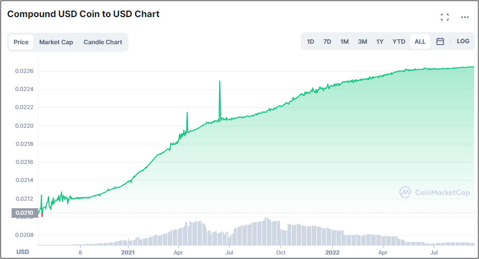

# Protocol operations

The Reserve Yield Protocol automates the entire life-cycle of Yield DTFs with fully onchain, autonomous smart contracts. The sections below break down how the protocol handles minting, collateral management, yield capture, and revenue distribution.

## Issuance & redemption

Anyone can bring the protocol X amount worth of collateral baskets and receive X DTF tokens in exchange for it. Anyone can also bring the protocol Y DTF tokens and receive Y worth of collateral baskets in return.

## Issuance throttle

As a way to limit the extractable value in the case of an attack or exploit of a Yield DTF, the protocol allows the DTF deployer (and governance) to set a limit on the rate of issuance.

The throttling mechanism works as a battery: after a large issuance, the issuance limit recharges linearly to the defined maximum at a defined speed of recharge.

The idea is to ensure net issuance for a Yield DTF never exceeds some bounds per unit time (hour). Limits can be set as a fixed amount of DTF tokens (e.g. 2,000,000 tokens) and/or as a percentage of token supply (e.g. 10% as default).

## Redemption throttle

Similar to the issuance throttle, each Yield DTF can have a redemption throttle to limit the amount of extractable value in the case of an attack or exploit.

The throttling mechanism works as a battery: after a large redemption, the redemption limit recharges linearly to the defined maximum at a defined speed of recharge.

The idea is to ensure net redemption for a DTF never exceeds some bounds per unit time (hour). Limits can be set as a fixed amount of DTF tokens (e.g. 2,500,000 tokens) and/or as a percentage of token supply (e.g. 12.5% as default).

Note: It is recommended that the redemption throttle is greater than the issuance throttle, to avoid consuming all the redemption throttle with an issue‑redeem operation.

## Staking and un-staking

Reserve Rights (RSR) holders can stake their RSR tokens on Yield DTFs to make DTF holders whole in the unlikely event of a collateral token default, and receive a portion of the revenue the DTF makes in return.

Right after staking RSR tokens on a Yield DTF, the staker receives an stRSR (staked Reserve Rights) token at a particular exchange rate to RSR. This exchange rate starts at 1.00 and will change over time—either by revenue being shared to the RSR stakers, or through overcollateralization slashing.

To participate and vote in Governance proposals, stakers need to delegate their stakes to themselves to activate their voting weight.

If an RSR staker decides to un-stake their RSR tokens, they’ll have to wait the un-staking delay (by default set to 2 weeks) before receiving their RSR tokens back. While in the delay period, the stRSR to RSR exchange rate is locked (the staker is no longer accumulating revenue from the DTF). However, the RSR is still liable to be slashed in the case of a collateral default.

The reason for a stRSR position needing to be slashable, but not earning revenue, during the un-staking delay period is because the alternative would allow for gaming of the system. If revenue was still being accumulated during the delay period, one could immediately un-stake after staking their RSR (and repeat this process) to circumvent the delay period—ultimately resulting in a less consistent overcollateralization pool.

Un-staking a stRSR position requires two transactions: one to initiate the un-staking process and one at the end of the delay period to receive the RSR tokens back. In between these two transactions the stRSR position is not transferable (as stRSR gets burned upon the first transaction).

## Asset management

ERC-20 assets that need to be used as part of a Yield DTF system (either as collateral or as revenue assets) need to be registered in the Asset Registry contract for that particular DTF.

Governance is in charge of registering, unregistering, and swapping assets.

* `register`: Adds the asset to the Asset Registry, including all the required details the protocol needs to handle that asset.
* `swapRegistered`: Allows modifying/updating details and functionality of a previously registered asset.
* `unregister`: Removes the asset from the Asset Registry. It will no longer be used by the Yield DTF system. The intended use of this function is for governance to remove bad collateral contracts. Proposals that perform unregistration of assets should include at the end a call to refresh the basket (`refreshBasket()`).

A detailed list of non-compatible ERC-20 assets is included in the [deployment walkthrough appendix](deployment-guide/yield-dtf-deployment-walkthrough.md#appendix).

## Revenue handling

### Source of revenue

The revenue that Yield DTFs accrue comes from their collateral baskets, including tokenized outputs from DeFi protocols such as cUSDC (Compound USDC), aDAI (Aave DAI), or various AMM LP tokens. These tokens are designed to increase monotonically (ever-increasing) against their base tokens, as they are pegged to the value of the base token + any borrowing/trading fees paid in the relevant pool.

The protocol can track the appreciation of a Yield DTF’s collateral tokens in USD terms, and decrement the redeemability for that DTF accordingly.

## Revenue distribution

There are several components essential to understanding how Yield DTF revenue is distributed to DTF holders or RSR stakers. Below they are introduced and then consolidated into the full picture.

#### Revenue distribution to Yield DTF holders

All collateral tokens provided to the protocol are stored in the Backing Manager (BM). The BM is responsible for holding them, minting more DTF tokens out of them, or trading them for DTF tokens or RSR (to later pay out rewards to DTF holders or RSR stakers).

If a Yield DTF X has revenue going entirely to DTF holders, the BM will periodically mint as many token X as it can from the growing collateral. Any remaining grown collateral that cannot be evenly minted into DTF X will be sent to the DTF Trader, where it will be traded directly for more token X through auctions.

After trading, both the newly minted token X and the newly traded token X will be consolidated in the Furnace. The Furnace is responsible for melting (= slowly burning) these new tokens, which incrementally increases the exchange rate between the DTF and its collateral basket.

To summarize: the protocol holds all collateral tokens in the Backing Manager. Whenever it can, it will mint new DTF tokens or trade excess collateral to DTF tokens via the DTF Trader. After minting/trading, the DTF tokens get melted via the Furnace—resulting in the DTF becoming more valuable (redeemable for more collateral tokens).

The revenue distribution to Yield DTF holders can be visualized as follows:

#### Revenue distribution to RSR stakers

If a Yield DTF Y has revenue going entirely to RSR stakers, the BM will periodically mint as many token Y as it can from the growing collateral. After minting, the newly minted tokens and all remaining grown collateral that could not be evenly minted into DTF Y will be sent to the RSR Trader, where it will be traded directly for RSR tokens through auctions.

After trading, the protocol sends all the newly acquired RSR to the stRSR pool, where it is slowly dripped out as rewards for the RSR stakers by increasing the stRSR/RSR exchange rate.

To summarize: the protocol holds collateral in the Backing Manager. Whenever it can, it trades excess collateral to RSR via the RSR Trader. After trading, the RSR get slowly handed out via the stRSR pool—resulting in stRSR becoming more valuable (redeemable for more RSR tokens).

The revenue distribution to RSR stakers can be visualized as follows:

#### Summary of revenue distribution

When deploying a Yield DTF, the deployer defines what portion of the revenue goes to DTF holders versus RSR stakers. For example, if a Yield DTF Z sends 40% of revenue to DTF holders and 60% to RSR stakers, the protocol will periodically:

* Take 40% of the accrued revenue in the Backing Manager, mint as many token Z as possible, send any remainder to the DTF Trader to trade for token Z, then consolidate newly minted/traded token Z in the Furnace to be melted—thereby increasing the exchange rate of DTF token Z to its collateral.
* Take 60% of the accrued revenue in the Backing Manager, mint as many token Z as possible, send the newly minted tokens and any remainder to the RSR Trader to trade for RSR, then send the newly acquired RSR to the stRSR pool to be dripped out to stRSR holders—thereby increasing the stRSR/RSR exchange rate.

The Reserve Yield Protocol can be configured to send (part of the) Yield DTF revenue to any arbitrary Ethereum address (e.g. to compensate the DTF deployer, to build a DTF treasury, etc). The deployer can decide whether to pay the third-party address in DTF tokens or RSR. In either case, the part of the revenue designated to the third-party address can be sent directly from the DTF Trader or the RSR Trader—it does not have to go through the Furnace or stRSR pool first.

## Recapitalization

### Fully collateralized vs. fully funded

When we talk about recapitalization, we distinguish between two states for a Yield DTF:

* Fully collateralized: the protocol holds the right balances of the right tokens to offer 100% redeemability.
* Fully funded: the protocol holds the right amount of value, but not necessarily the right amounts of collateral to offer 100% redeemability.

The Reserve Protocol aims to be fully collateralized at all times, but may not always be. For example, right after governance decides to change the collateral basket, the protocol may be fully funded but not yet fully collateralized. Similarly, in the case of a collateral default, the protocol might be fully funded through excess collateral or RSR overcollateralization, but not fully collateralized to offer full redeemability.

When the protocol is not fully collateralized, it will sell off any assets it holds that are not part of the proper collateral basket until either (a) the protocol is fully collateralized again or (b) RSR from the stRSR contract needs to be sold to recapitalize the protocol.

#### Recapitalization through Reserve Rights

If any of a Yield DTF's collateral tokens default, the default flag would be raised by the protocol through the default checking mechanisms explained in the [Monetary Units section](/broken/pages/3aafb33ad9285a046a5b53448d8fdc3120c68ae4#monetary-units). At that point, the protocol will sell as much of the faulty collateral as it can through auctions and use the proceeds, as well as any excess collateral still in the system, to purchase the predefined emergency collateral (see the [Deployment Guide](deployment-guide/)).

If auction proceeds and excess collateral are insufficient to fully collateralize the DTF with the emergency collateral, the protocol will attempt to recapitalize using RSR tokens staked in the stRSR contract. The required amount of RSR tokens will be seized from the stRSR contract and sold for the required amount of emergency collateral through auctions—resulting in an even “haircut” for all RSR stakers.

## Auctions

Auctions are employed whenever an asset within the DTF system is traded for another asset. Possible scenarios include (1) processing DTF revenue and (2) recollateralization following a basket change or a collateral default. The Reserve Yield Protocol supports multiple trading systems; currently it provides support for two auction implementations:

* Dutch Auctions
* Batch Auctions

It is anticipated that Dutch auctions will be the preferred trading method, with a fallback to batch auctions available when manipulation is suspected or a more manual trading process is warranted.

### Dutch Auctions

A Dutch auction is a type of auction where the item starts at a high price, and the price lowers until a buyer accepts the current price. The Reserve Protocol's implementation of Dutch auctions utilizes a 4-phase price reduction mechanism which safeguards against potential price manipulations and accommodates natural price fluctuations during the auction.



### Phase 1

The auctioned asset declines from 1000x of its expected price down to 1.5x. Bids are not expected during this period; this serves as a safeguard against price manipulation.



### Phase 2

The asset falls from 1.5x its expected price down to 1x the expected price. This stage acknowledges the potential for natural price movements during the auction.



### Phase 3

The asset declines from its expected price to its worst possible price, accounting for oracle errors and the max trade slippage parameter. This is where most bids are expected to occur.



### Phase 4

The price remains static at the worst price, providing an opportunity for manual human bidding in the absence of bots.



A Dutch Auction completes when a user places a full-lot bid or when the auction time runs out and a user chooses to close the auction with no bids. At that point either a new Dutch Auction or a Batch Auction can be run for the same assets.

### Batch Auctions

Reserve relies on Gnosis' Easy Auction (https://gnosis-auction.eth.link/) for its implementation of batch auctions. Batch auctions match limit orders of buyers and sellers at one fair clearing price by fulfilling the batch of bids above an acceptable minimum price that satisfies the supply being sold.

Example: if 10 tokens X are sold and bids are:

* A buys 5 at $10/token
* B buys 4 at $9/token
* C buys 4 at $5/token

Then A and B receive 5 and 4 tokens respectively, C receives 1 token, and all bids clear at $5/token.
